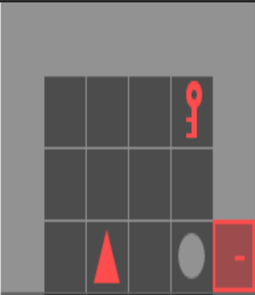

# Minigrid-Language-Wrapper

Wrap Minigrid environments with text-based observations and actions

## Example



Text observation:
```
# Agent located at (3, 6) within field of view
grey wall at (1, 3)
grey wall at (1, 4)
grey wall at (1, 5)
grey wall at (1, 6)
grey wall at (2, 3)
grey wall at (3, 3)
grey wall at (4, 3)
grey wall at (5, 3)
red key at (5, 4)
grey ball at (5, 6)
grey wall at (6, 3)
grey wall at (6, 4)
grey wall at (6, 5)
locked red door at (6, 6)
```

## Roadmap

## Quickstart

Install requirements:

```bash
python -m pip install -r requirements/base.txt
python -m pip install -r requirements/dev.txt
python -m pip install -e .
```

Open a CLI which does manual control
```bash
# Note: room_obs only works for RoomGrid environments
python examples/manual_control.py \
    --env-id MiniGrid-UnlockPickup-v0 \
    --use-roomtext-obs
```
